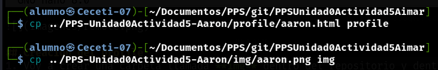
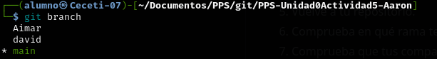
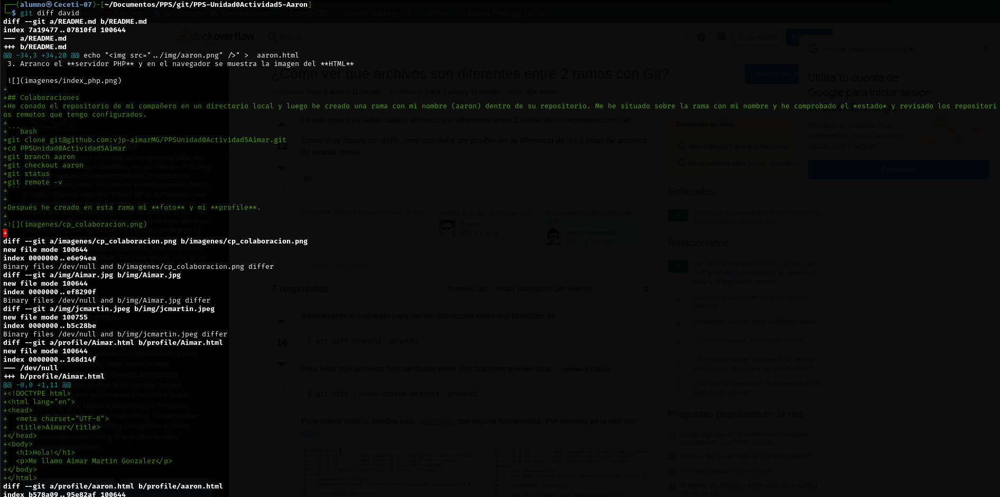
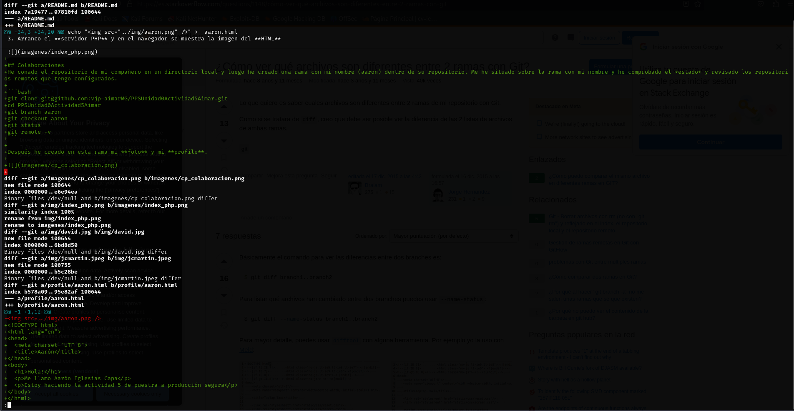
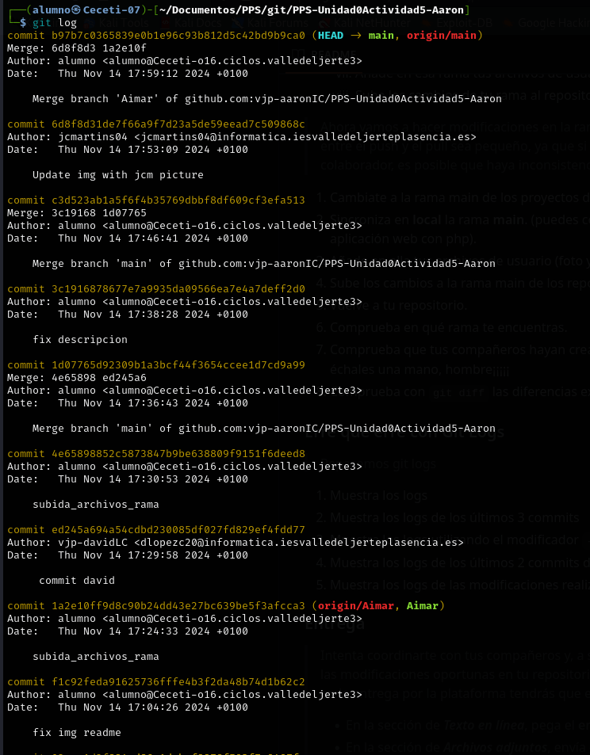
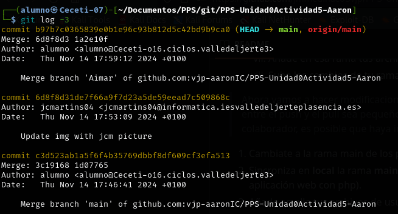
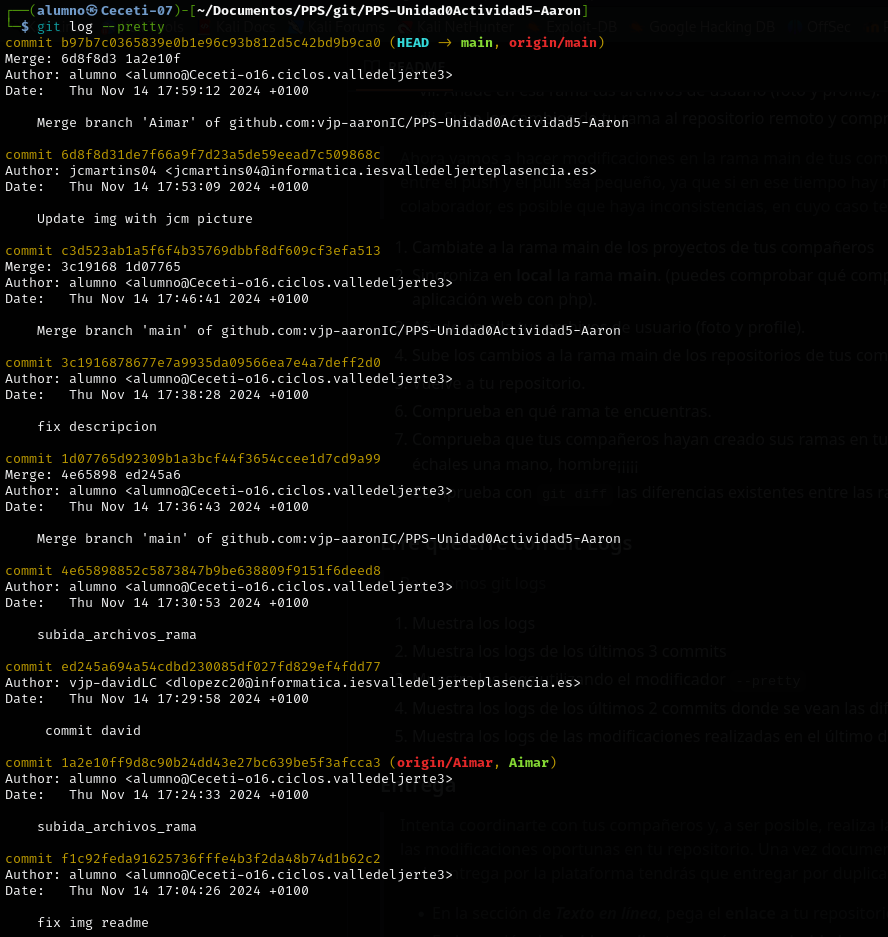

# PPS-Unidad0Actividad5-Aaron

## Descripción de la actividad
En esta actividad voy a colaborar con compañeros a través de Github y de sus funcionalidades.
Voy a crear ramas en repositorios en los que me han dado permisos de colaborador, documentando todo el proceso.

## Visualización de repositorios remotos
Podemos visualizar los repositorios remotos configurados

```bash
git remote -v
```


## Creación del profile
1. Voy a crear una carpeta llamada **img** dentro del repositorio y dentro añadiré una imagen que se llamará **aaron.png**.

```bash
mkdir img
```


2. Voy a crear la carpeta profile y dentro voy a crear un **HTML** (aaron.html). Este **HTML** va a contener una imagen que se llama **aaron.png**.

```bash
mkdir profile
echo "" >  aaron.html
```


3. Arranco el **servidor PHP** y en el navegador se muestra la imagen del **HTML**


## Colaboraciones
He conado el repositorio de mi compañero en un directorio local y luego he creado una rama con mi nombre (aaron) dentro de su repositorio. Me he situado sobre la rama con mi nombre y he comprobado el *estado* y revisado los repositorios remotos que tengo configurados.

```bash
git clone git@github.com:vjp-aimarMG/PPSUnidad0Actividad5Aimar.git
cd PPSUnidad0Actividad5Aimar
git branch aaron
git checkout aaron
git status
git remote -v
```

Después he creado en esta rama mi **foto** y mi **profile**.



Primero he comprobado que mis compañeros han creado sus ramas con este comando:

```bash
git branch
```



He mostrado las diferencais entre mi rama **main** y las ramas de mis compañeros






## Git logs

ver los git logs

```bash
git log
```



ver los últimos 3 logs

```bash
git log -3
```



ver git log con pretty

```bash
git log --pretty
````



ver las diferencias de los últimos dos commits

```bash
git log -p -n 2
```

ver los logs del último día

```bash
git log --since="1 day ago"
```
