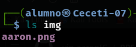
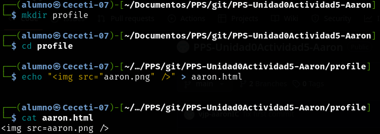
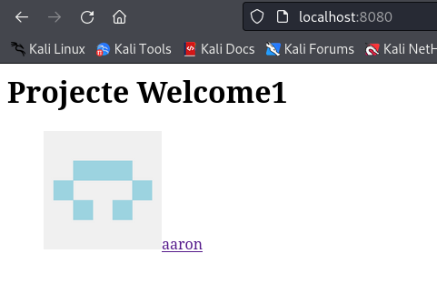

# PPS-Unidad0Actividad5-Aaron

## Descripción de la actividad
En esta actividad voy a colaborar con compañeros a través de Github y de sus funcionalidades.
Voy a crear ramas en repositorios en los que me han dado permisos de colaborador, documentando todo el proceso.

## Visualización de repositorios remotos
Podemos visualizar los repositorios remotos configurados

```bash
git remote -v
```


## Creación del profile
1. Voy a crear una carpeta llamada **img** dentro del repositorio y dentro añadiré una imagen que se llamará **aaron.png**.

```bash
mkdir img
```



2. Voy a crear la carpeta profile y dentro voy a crear un **HTML** (aaron.html). Este **HTML** va a contener una imagen que se llama **aaron.png**.

```bash
mkdir profile
echo "" >  aaron.html
```



3. Arranco el **servidor PHP** y en el navegador se muestra la imagen del **HTML**


